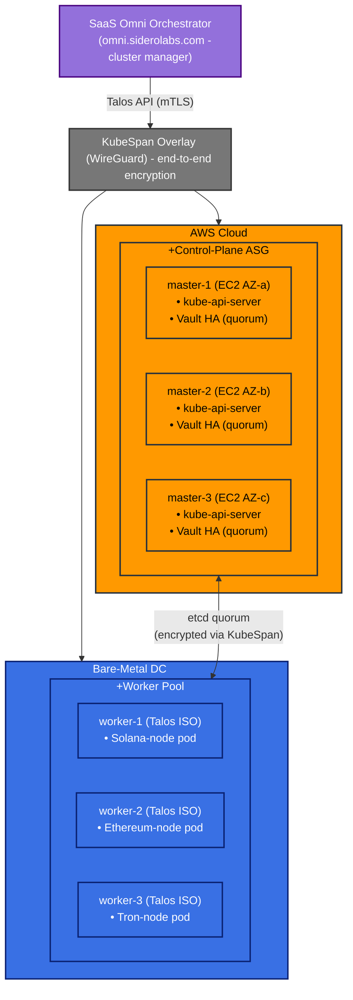

# Legend

### SaaS Omni orchestrates lifecycle of all Talos nodes.

- KubeSpan creates a WireGuard mesh so every control‑plane and worker node
  sees a single, private /24 overlay—no VPNs or flat networks required.

- Control‑plane (3 × Talos masters on AWS EC2):
    - Runs etcd quorum, kube‑api‑server, controller‑manager, scheduler.
    - Exposed only on WireGuard IPs; no public 6443.
    - Hosts a 3‑pod HashiCorp Vault cluster in integrated storage (raft)
      mode—one pod per master for HA.

- Worker pool (bare‑metal Talos servers):
    - Hosts stateful Ethereum & Tron blockchain pods (1 replica each; data
      on local NVMe).

- All intra‑cluster traffic—including etcd, Vault gossip, and blockchain
  peer‑to‑peer sync—flows through the encrypted KubeSpan overlay.

